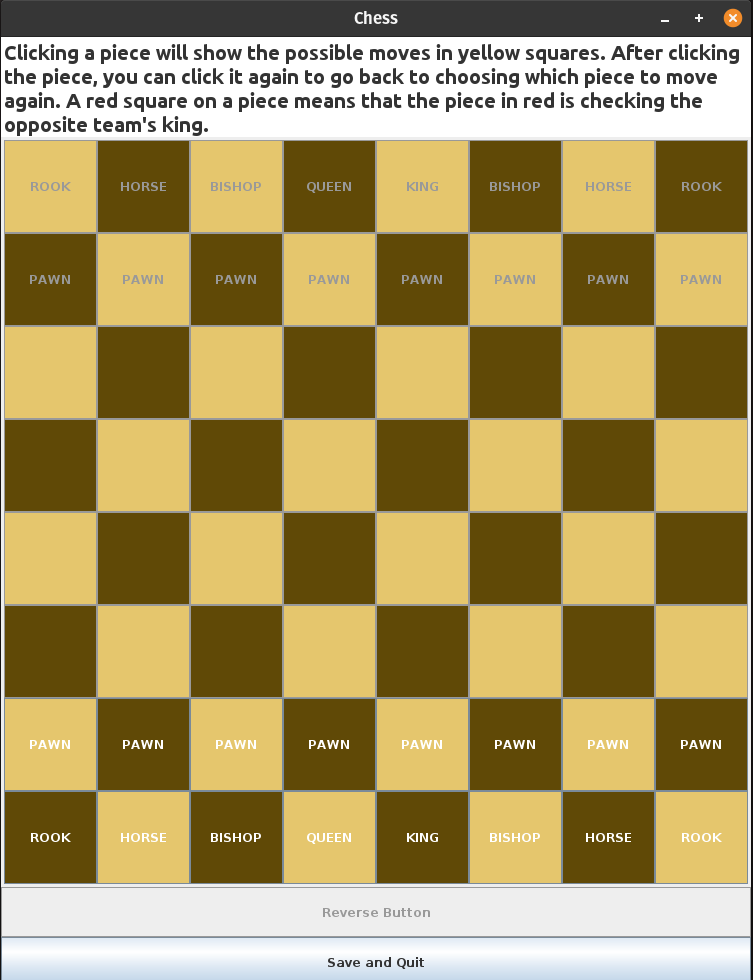
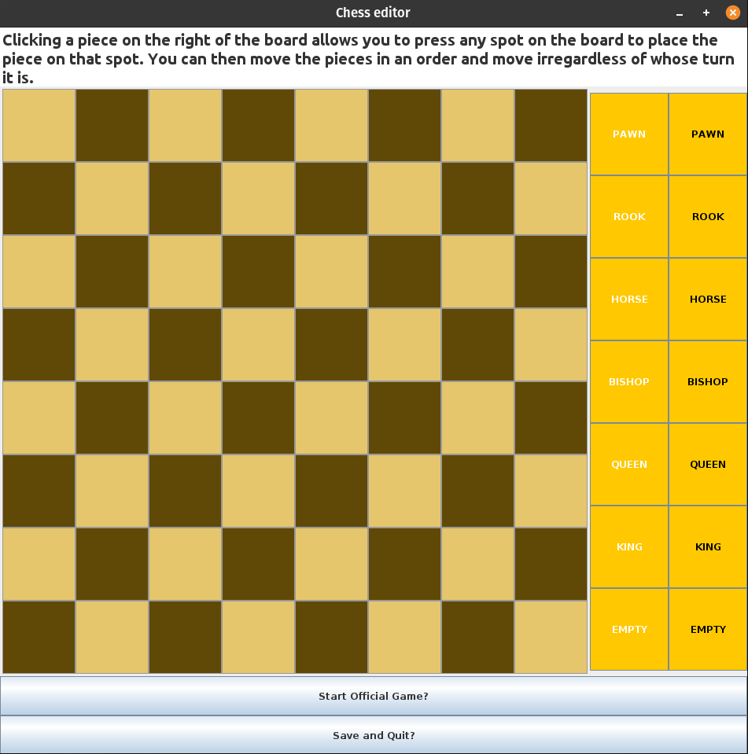
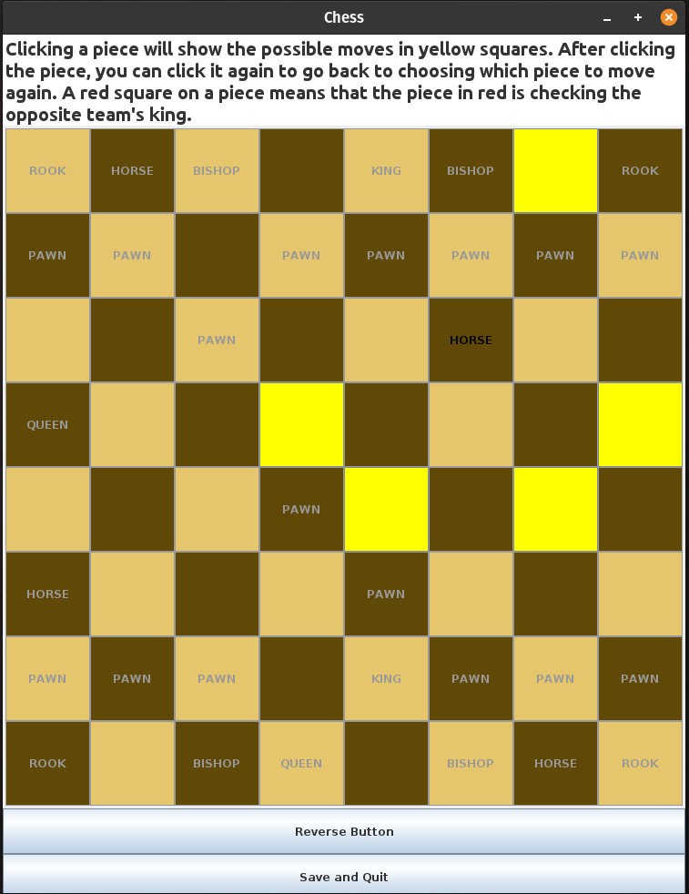
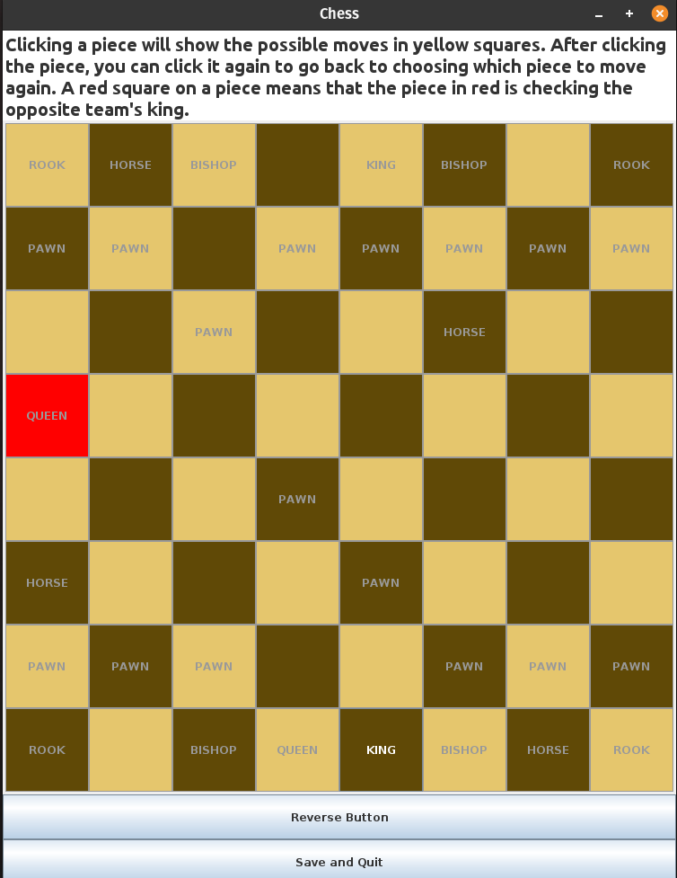

# Chess
Chess game

Simple chess game with possible move showed in yellow, when a piece is pressed.
Also shows when a piece is checking a king by highlighting it in red.
Clicking a piece makes every other piece unclickable except for the possible moves.
Reclicking the same piece allows for the player to go back to choosing which piece to move.

## Features
- Board editor mode (currently separate)
- Highlight possible moves in yellow
- Highlight checking pieces in red
- Undo move
- Saving and loading game when closing and opening application

